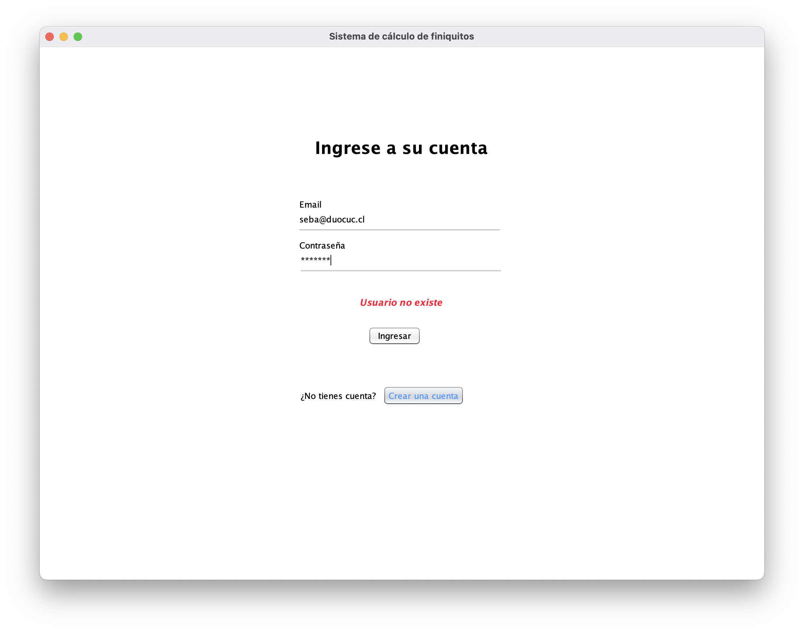
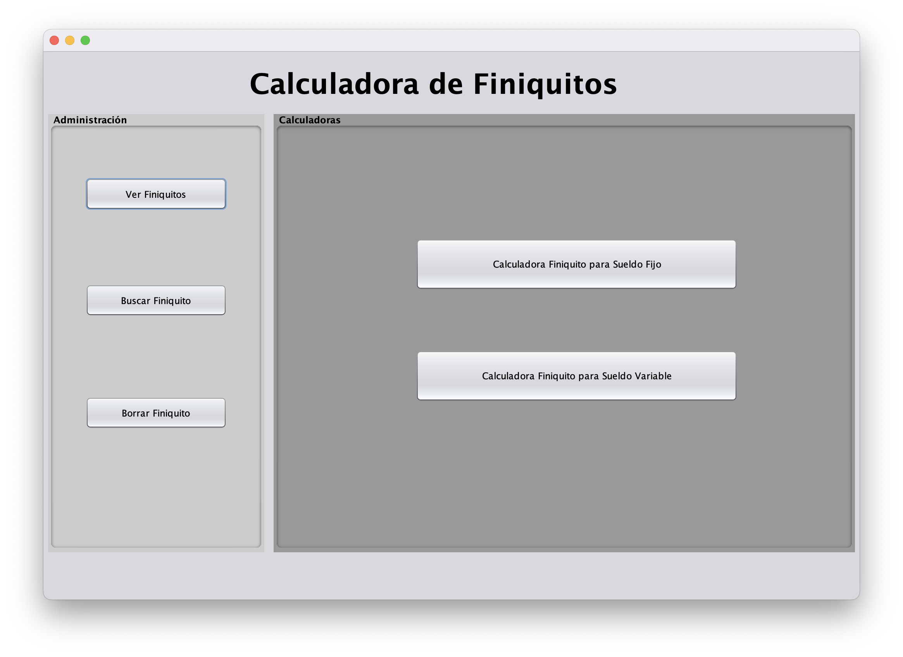
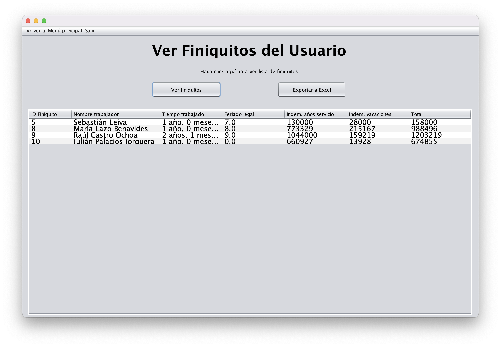
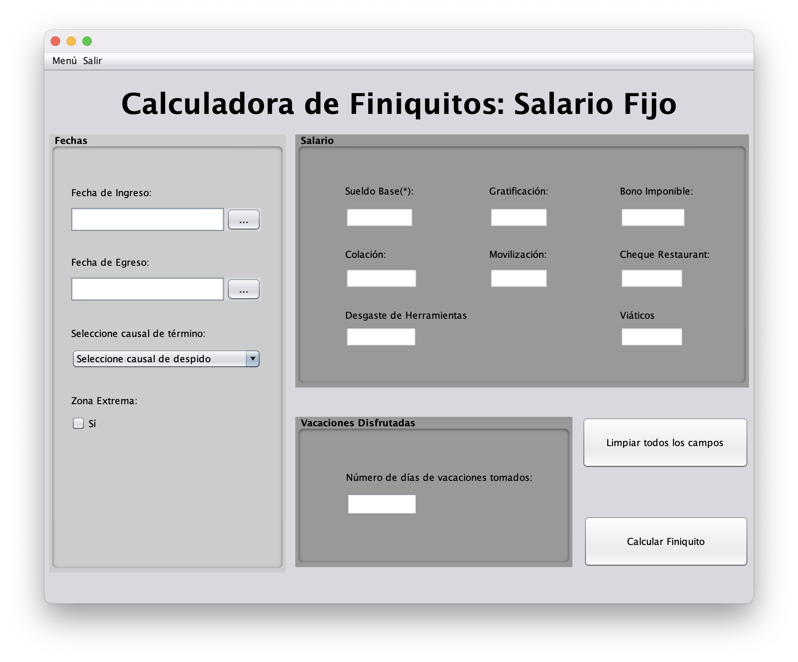

# Aplicación generadora de Finiquitos Laborales (Chile)

### 🛠️ Desarrollada por J.Valdés [(@ponytakxn)](https://github.com/ponytakxn) y S.Kravetz [(@rrooddooxx)](https://github.com/rrooddooxx)

> Aplicación calculadora de finiquitos, en base al código del trabajo vigente en Chile al año 2022.
> Incluye persistencia de datos en base de datos MySQL para guardar los finiquitos generados.

_Proyecto para asignatura de Desarrollo de Software de Escritorio (PGY2121)_

_Duoc UC, Sede Viña Del Mar._

## 📸 Capturas






## 📦 Dependencias

```
Java 11 (OpenJDK)
Maven
mysql-connector-j
lgooddatepicker
jxls
jxls-poi
maven-assembly-plugin
```

## 🚀 Ejecución

```
1. Clonar repositorio
2. Ejecutar target/FiniquitosCalc-1.0-SNAPSHOT-jar-with-dependencies.jar
```

## 🛠 Colaboración

```
Clona el proyecto, crea un branch y solicita un Pull Request!
```
